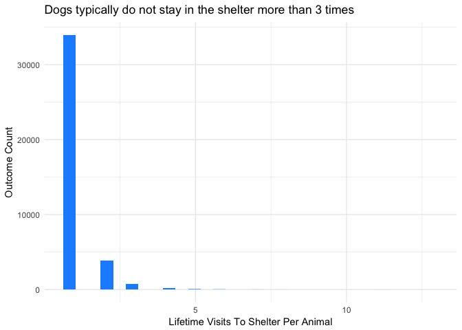
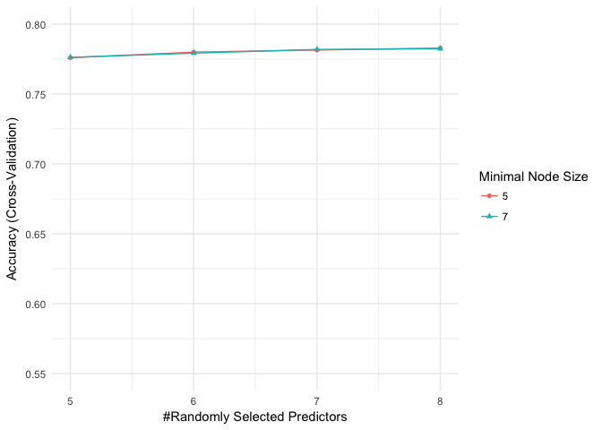

Final Project - Save The Pups
================
Tyler Mallon, Caleb Herrera, Lynssey Brim, Thomas del Zoppo
28 August, 2018

### Introduction & Background

The Austin Animal Center (AAC) is the largest no-kill municipal animal shelter in the United States. They are an open-intake facility providing shelter and protection to all animals regardless of their condition upon intake. They seek not to euthanize more than 10% of the animals they receive, and usually to do so only as a means of ending suffering. The goal of the AAC is to place all animals that can be adopted into permanent homes, and most of their animals are dogs. So, the primary goal of our research is to help the AAC to better predict whether an animal can be adopted based upon an analysis of AAC data observations.

When looking at Intake and Outcome data on dogs sheltered at the AAC, we hypothesize that there are statistically significant attributes of dogs and shelter conditions that will provide predictive foresight into the outcome of a dog upon leaving the shelter. In addition to adoption and euthanasia outcomes, we observe and analyze many cases where dogs are returned to their owners or transferred away to partner shelters, which may or may not be no-kill shelters. For the AAC to optimize the use of its limited resources by prolonging the sheltering of dogs most likely to be adopted (or returned) and hastening the transfer of dogs most likely to be transferred, we attempt to accurately model the attributes of dogs and shelter conditions that most likely lead to adoption. With this data driven insight, the shelter can showcase or transfer dogs accordingly to better manage their resources and maximize adoptions over time.

------------------------------------------------------------------------

### EDA Overview

Although there were a few other outcome types observed in the shelter population, after performing an exploratory data analysis (EDA), we decided to limit our sample set to dogs with the four most prevalent outcome types; Adoption, Euthanasia, Return to Owner, and Transfer. Out EDA confirmed several of our intuitions. First, owners prefer not to adopt dogs that still have their reproductive capabilities still intact. Second, owners prefer to adopt younger animals. Third and finally, Owners prefer to adopt animals that are in good health. Using additional insights discovered through the EDA, as well as our intuition, we narrowed down the number of variables to include in our models in order to provide greater interpretability and computational efficiency to the models. It was also necessary to transform the data types of a few of the variables for programming purposes. After doing some research on the adoption of dogs in general, we discovered a notable pattern that black colored dogs seem to be adopted less. In addition to that fact, our "color" variable had an extensive amount of choices. So, we decided to simplify the color variables as either black or not. Similar to "color," the number of "breed" choices were also very high and likewise would have been extremely complicated to analyze computationally, so we grouped all the breeds into the eight different groups that dog breeds fall into. These are broken down into seven primary categories of dogs, and one miscellaneous category for any dog that does not fall under those seven primary groupings.

#### EDA Process - Variable Exploration

In the initial dataset, there are 10 different possible values of outcome type which are listed below:

    ## # A tibble: 10 x 1
    ##    outcome_type   
    ##    <chr>          
    ##  1 Return to Owner
    ##  2 Transfer       
    ##  3 Adoption       
    ##  4 Euthanasia     
    ##  5 Died           
    ##  6 Rto-Adopt      
    ##  7 Missing        
    ##  8 Disposal       
    ##  9 <NA>           
    ## 10 Relocate

In the initial dataset, there are 20 different possible values of outcome subtype which are listed below:

    ## # A tibble: 20 x 1
    ##    outcome_subtype    
    ##    <chr>              
    ##  1 <NA>               
    ##  2 Partner            
    ##  3 Foster             
    ##  4 Suffering          
    ##  5 Medical            
    ##  6 Behavior           
    ##  7 In Kennel          
    ##  8 Aggressive         
    ##  9 Rabies Risk        
    ## 10 In Foster          
    ## 11 At Vet             
    ## 12 Offsite            
    ## 13 Snr                
    ## 14 Possible Theft     
    ## 15 SCRP               
    ## 16 Court/Investigation
    ## 17 Enroute            
    ## 18 In Surgery         
    ## 19 Barn               
    ## 20 Underage

In the initial dataset, there are 6 different possible values of reproductive status which are listed below:

    ## # A tibble: 6 x 1
    ##   sex_upon_outcome
    ##   <chr>           
    ## 1 Neutered Male   
    ## 2 Spayed Female   
    ## 3 Intact Female   
    ## 4 Intact Male     
    ## 5 Unknown         
    ## 6 NULL

In the initial dataset, there are 5 different possible values of intake type which are listed below:

    ## # A tibble: 5 x 1
    ##   intake_type       
    ##   <chr>             
    ## 1 Stray             
    ## 2 Public Assist     
    ## 3 Owner Surrender   
    ## 4 Euthanasia Request
    ## 5 Wildlife

In the initial dataset, there are 8 different possible values of the animal's health status which are listed below:

    ## # A tibble: 8 x 1
    ##   intake_condition
    ##   <chr>           
    ## 1 Normal          
    ## 2 Injured         
    ## 3 Aged            
    ## 4 Sick            
    ## 5 Other           
    ## 6 Feral           
    ## 7 Pregnant        
    ## 8 Nursing

In the initial dataset, it appears that almost all of the animals are cats and dogs. A minor amount of other animal types are present.

    ## # A tibble: 4 x 2
    ##   animal_type counts
    ##   <chr>        <int>
    ## 1 Bird           339
    ## 2 Cat          29539
    ## 3 Dog          45366
    ## 4 Other         4428

In the initial dataset, it appears that there are 1919 unique breeds of animals.

    ## # A tibble: 1,919 x 1
    ##    breed                      
    ##    <chr>                      
    ##  1 Spinone Italiano Mix       
    ##  2 Dachshund                  
    ##  3 Shetland Sheepdog          
    ##  4 Labrador Retriever/Pit Bull
    ##  5 Miniature Schnauzer Mix    
    ##  6 Lhasa Apso Mix             
    ##  7 Shetland Sheepdog Mix      
    ##  8 Dachshund Mix              
    ##  9 Border Collie Mix          
    ## 10 Chihuahua Shorthair        
    ## # ... with 1,909 more rows

In the initial dataset, there are 337 unique color combinations of animals

    ## # A tibble: 337 x 1
    ##    color       
    ##    <chr>       
    ##  1 Yellow/White
    ##  2 Tricolor    
    ##  3 Brown/White 
    ##  4 Black/White 
    ##  5 Black/Gray  
    ##  6 White/Black 
    ##  7 Black/Tan   
    ##  8 Tan/Black   
    ##  9 Black       
    ## 10 Gold/Gold   
    ## # ... with 327 more rows

#### EDA Process - Distributional Exploration

In the initial dataset, almost all the animals have only visited the shelter once. A small portion of the animals have been to the shelter twice and there are almost no animals that have been there three or more times.

It appears that there are four primary outcomes: Adoption, Transfer, Return to Owner, and Euthanasia

The distributions for cats and dogs across the four primary outcome types are fairly similar.

As a proportion of the possible outcomes, it is clear that spayed and neutered cats and dogs are almost all of the animals that end up getting adopted.

As a proportion of the possible outcomes, it is clear that injured and sick animals make up the majority of animals that have an outcome type of euthanasia.

------------------------------------------------------------------------

### Model Choice/Description

The statistical learning methods that we used to develop our models were K Nearest Neighbors (KNN) and Random Forests. The first models we ran were KNN models. We chose to use KNN because this method is nonparametric and allows us to develop a model without yet knowing the importance of specific variables or having to choose variables accordingly. Another reason we chose to use the KNN method is that it's easy to make modifications to this type of model, allowing us to produce a large number of potential models. This ease of modification comes from the fact that the only tuning parameter we need to just is the number of K.

After developing the KNN models, we moved on to creating models using the Random Forest method. We chose this method because of its classifying power. Typical decision trees often have a high variance and thus can struggle when there are large differences in the dataset from which the model was initially trained on. Random Forests, however, circumvent this problem by using an ensemble approach of creating many trees and using the aggregate results of each tree as a combined output. Another relevant factor for choosing this method was its ability to provide in-model calculated variable-importance measures, allowing us to see which variables have the greatest impact on the outcomes rather than making educated guesses. The random forest method we have utilized returns the variable importance, scaled from 0 to 100 for each class of variable. In this model, the predictors that ended up having the most importance were the following: how long the dog had been at the shelter (this had an importance of 100), the age of the dog, the intake type of the dog (whether the dog was a stray, an owner surrender, a public assist, etc.), and the dog's sex upon outcome. Another slightly less important variable was the reproductive status of the dog upon intake (whether the dog had been "fixed" or not). The variables with the least amount of importance were breed type and our modified color variable identifying whether dog was black or not.

------------------------------------------------------------------------

### Results

#### KNN

The KNN model we produced performed relatively well, with the highest accuracy percentage coming in at 69.76% using a K value of 11. For our K values, we used only odd values up to 17. From outside research, using only odd values seemed to be an industry best practice when using KNN so that each point would have majority category rather than being evenly split between two categories. In addition to the accuracy measurement, the KNN model provides another variable, Kappa, which is a metric that compares observed accuracy with expected accuracy. A Kappa of &gt;.75 is considered to be excellent, while a Kappa between .4 and .75 is considered fair to good. The KNN model with a K value of 11 also had one of the highest Kappa values of .52, a fair to good value, and was only separated by .001 from the highest Kappa value.

    ## k-Nearest Neighbors 
    ## 
    ## 31538 samples
    ##    14 predictor
    ##     4 classes: 'Adoption', 'Euthanasia', 'Return to Owner', 'Transfer' 
    ## 
    ## No pre-processing
    ## Resampling: Cross-Validated (10 fold) 
    ## Summary of sample sizes: 28385, 28384, 28384, 28384, 28384, 28385, ... 
    ## Resampling results across tuning parameters:
    ## 
    ##   k   Accuracy   Kappa    
    ##    1  0.6581262  0.4767597
    ##    3  0.6888515  0.5135526
    ##    5  0.7028027  0.5289563
    ##    7  0.7103808  0.5369485
    ##    9  0.7179590  0.5466953
    ##   11  0.7187838  0.5464029
    ##   13  0.7186885  0.5447088
    ##   15  0.7170713  0.5413360
    ##   17  0.7162150  0.5390829
    ## 
    ## Accuracy was used to select the optimal model using the largest value.
    ## The final value used for the model was k = 11.

#### Random Forest

After optimizing our KNN modeling, we developed a few Random Forest models in an attempt to improve our test accuracy, along with the model's Kappa value. For our first Random Forest model, we used a range of 2-5 for the number of random variables to select from at each break (mtry). In our first model, we saw that the test accuracy continually increased with each marginal increase in our mtry variable. The highest accuracy achieved in the first model was about 78.3%. Since the accuracy increased with each value of mtry, we decided to create a second model with even higher values of mtry in order to determine the highest practical level of accuracy that could be obtained, and the level of mtry at which the accuracy might begin to increase by only a negligible amount. Thus, our second model had mtry values of 5-8. In this second model we likewise observed that the highest accuracy and Kappa values were developed at an mtry of 8. The results indicated a direct relationship between mtry and accuracy. However, when graphing the increase of accuracy compared to the increase in mtry, we noted that the model accuracy began to plateau at an mtry value of 8. Accordingly, we chose to leave our models with a max mtry value of 8. The second Random Forest model achieved an accuracy of 79.5% with a Kappa value 67.4, both of which were much higher than the values of the first Random Forest model and the KNN model.

    ## Random Forest 
    ## 
    ## 31538 samples
    ##    14 predictor
    ##     4 classes: 'Adoption', 'Euthanasia', 'Return to Owner', 'Transfer' 
    ## 
    ## No pre-processing
    ## Resampling: Cross-Validated (10 fold) 
    ## Summary of sample sizes: 28383, 28384, 28385, 28383, 28383, 28384, ... 
    ## Resampling results across tuning parameters:
    ## 
    ##   mtry  min.node.size  splitrule   Accuracy   Kappa    
    ##   2     1              gini        0.6440481  0.3878245
    ##   2     1              extratrees  0.5581526  0.2262878
    ##   2     3              gini        0.6453485  0.3902997
    ##   2     3              extratrees  0.5578356  0.2254046
    ##   2     5              gini        0.6432865  0.3864946
    ##   2     5              extratrees  0.5594516  0.2282843
    ##   3     1              gini        0.7373964  0.5685651
    ##   3     1              extratrees  0.6475051  0.4196677
    ##   3     3              gini        0.7371430  0.5678867
    ##   3     3              extratrees  0.6476004  0.4198140
    ##   3     5              gini        0.7361915  0.5664675
    ##   3     5              extratrees  0.6459202  0.4169225
    ##   4     1              gini        0.7682480  0.6248161
    ##   4     1              extratrees  0.6859035  0.4970189
    ##   4     3              gini        0.7691672  0.6263481
    ##   4     3              extratrees  0.6833666  0.4922169
    ##   4     5              gini        0.7678993  0.6241283
    ##   4     5              extratrees  0.6842544  0.4943676
    ##   5     1              gini        0.7766823  0.6404242
    ##   5     1              extratrees  0.6949083  0.5150890
    ##   5     3              gini        0.7764604  0.6400476
    ##   5     3              extratrees  0.6953837  0.5159345
    ##   5     5              gini        0.7764604  0.6399683
    ##   5     5              extratrees  0.6936081  0.5130652
    ## 
    ## Accuracy was used to select the optimal model using the largest value.
    ## The final values used for the model were mtry = 5, splitrule = gini
    ##  and min.node.size = 1.

    ## Random Forest 
    ## 
    ## 31538 samples
    ##    14 predictor
    ##     4 classes: 'Adoption', 'Euthanasia', 'Return to Owner', 'Transfer' 
    ## 
    ## No pre-processing
    ## Resampling: Cross-Validated (10 fold) 
    ## Summary of sample sizes: 28383, 28383, 28384, 28386, 28384, 28384, ... 
    ## Resampling results across tuning parameters:
    ## 
    ##   mtry  min.node.size  Accuracy   Kappa    
    ##   5     5              0.7759206  0.6391991
    ##   5     7              0.7761424  0.6394948
    ##   6     5              0.7799158  0.6464257
    ##   6     7              0.7791866  0.6451661
    ##   7     5              0.7814059  0.6496042
    ##   7     7              0.7818183  0.6503395
    ##   8     5              0.7828330  0.6527757
    ##   8     7              0.7822940  0.6517651
    ## 
    ## Tuning parameter 'splitrule' was held constant at a value of gini
    ## Accuracy was used to select the optimal model using the largest value.
    ## The final values used for the model were mtry = 8, splitrule = gini
    ##  and min.node.size = 5.

    ## Confusion Matrix and Statistics
    ## 
    ##                  Reference
    ## Prediction        Adoption Euthanasia Return to Owner Transfer
    ##   Adoption            5988        107             373     1002
    ##   Euthanasia             1        200               3        3
    ##   Return to Owner       80         46            3520      110
    ##   Transfer             105         97              85     1794
    ## 
    ## Overall Statistics
    ##                                          
    ##                Accuracy : 0.8511         
    ##                  95% CI : (0.845, 0.8571)
    ##     No Information Rate : 0.4569         
    ##     P-Value [Acc > NIR] : < 2.2e-16      
    ##                                          
    ##                   Kappa : 0.7644         
    ##  Mcnemar's Test P-Value : < 2.2e-16      
    ## 
    ## Statistics by Class:
    ## 
    ##                      Class: Adoption Class: Euthanasia
    ## Sensitivity                   0.9699           0.44444
    ## Specificity                   0.7981           0.99946
    ## Pos Pred Value                0.8016           0.96618
    ## Neg Pred Value                0.9692           0.98121
    ## Precision                     0.8016           0.96618
    ## Recall                        0.9699           0.44444
    ## F1                            0.8777           0.60883
    ## Prevalence                    0.4569           0.03330
    ## Detection Rate                0.4431           0.01480
    ## Detection Prevalence          0.5528           0.01532
    ## Balanced Accuracy             0.8840           0.72195
    ##                      Class: Return to Owner Class: Transfer
    ## Sensitivity                          0.8842          0.6167
    ## Specificity                          0.9752          0.9729
    ## Pos Pred Value                       0.9372          0.8621
    ## Neg Pred Value                       0.9528          0.9025
    ## Precision                            0.9372          0.8621
    ## Recall                               0.8842          0.6167
    ## F1                                   0.9099          0.7190
    ## Prevalence                           0.2946          0.2153
    ## Detection Rate                       0.2605          0.1328
    ## Detection Prevalence                 0.2779          0.1540
    ## Balanced Accuracy                    0.9297          0.7948

#### Variable Importance

After producing the second Random Forest model, we decided to look at the statistics by class. We discovered that the most important variables in determining the outcome for dogs in the shelter are: how long the dog has been in the shelter (in days), how old the dog is, and the outcome hour. In addition to observing what the most significant variables were, we were able to look at the sensitivity and specificity of our models in predicting the outcome types. In the case of predicting adoptions, the sensitivity value relays the accuracy percentage of those dogs predicted to be adoptions that were truly adopted. Specificity, on the other hand, relays the percentage of dogs predicted to not be euthanized that were actually not euthanized. When taking these considerations into account, we see that our last model is particularly good at predicting when an animal won’t be euthanized (99% Specificity), or when an animal will be adopted (93% Sensitivity).

    ## ranger variable importance
    ## 
    ##   only 20 most important variables shown (out of 68)
    ## 
    ##                             Overall
    ## timeinshelterdays           100.000
    ## `ageuponoutcome(days)`       30.435
    ## intaketypePublic Assist      17.659
    ## intaketypeOwner Surrender    17.303
    ## sexuponoutcomeSpayed Female  13.106
    ## intaketypeStray              13.063
    ## sexuponoutcomeIntact Male    11.077
    ## sexuponoutcomeNeutered Male  10.737
    ## sexuponintakeIntact Male      6.530
    ## sexuponintakeNeutered Male    5.739
    ## sexuponintakeSpayed Female    5.157
    ## outcomenumber2                4.493
    ## intakeconditionNormal         4.358
    ## isblack1                      4.105
    ## dogtype1Miscelaneous Group    3.724
    ## outcomeweekdaySaturday        3.656
    ## dogtype1Toy Group             3.470
    ## outcomeweekdaySunday          3.176
    ## dogtype1Sporting Group        2.898
    ## outcomeweekdayMonday          2.875

------------------------------------------------------------------------

### Conclusion

After developing two primary types of models, and several modifications of both, we were able to produce a best-fit model that correctly predicted the outcome of a dog in the AAC shelter with about 80% accuracy, though not all outcomes were predicted equally. If the shelter looks to predict whether a dog will be adopted or not, we can predict with great accuracy whether it will be adopted. Additionally, if the shelter is contemplating euthanasia, our best-fit model is almost perfect at predicting when animals should not be euthanized. This is very applicable to our business question in that we can determine which dogs should be kept on hand for homes to adopt. This insight could also serve to prevent the unnecessary deaths of animals that won't need to be euthanized.

A few modifications could be made to improve the performance of our modeling in the future. Though we chose to simplify both the color and breed variables in order to alleviate computational difficulty, our results seem to indicate that we may have been better served by allowing the original specificity to better determine any breeds or colors more or less likely to be adopted. In addition to this modification, we recognize that it may be impractical to utilize the variable of how long the dog has been in the shelter in order to predict the dog's future outcome on the day of its intake. This is because the number of days a dog will be in the shelter is unknown on the day of its intake. Creating a forecasting model that can predict how long a dog will be in the shelter would be helpful to supply a prediction for our model to use as the number of days that a dog will ultimately be in the shelter. Lastly, we only tried two different methods of classification. There are certainly other methods of classification that could perform well on a data set like this, for example, Linear or Quadratic Discriminant Analysis.
