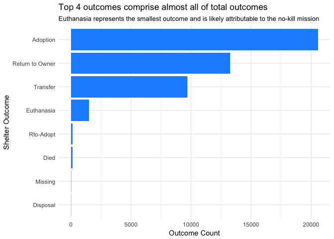
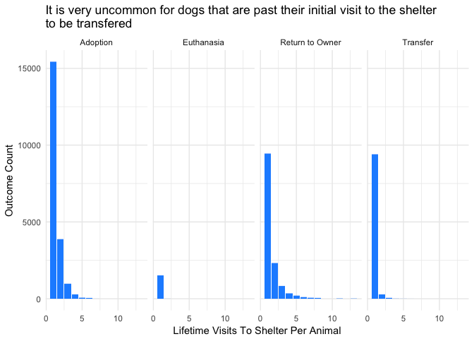
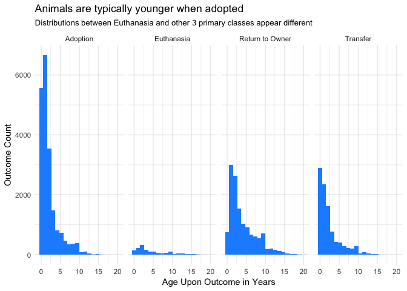

Dog Adoption
================
Tyler Mallon
03 October, 2018

### Introduction & Background

The Austin Animal Center (AAC) is the largest no-kill municipal animal shelter in the United States. They are an open-intake facility providing shelter and protection to all animals regardless of their condition upon intake. They seek to only euthanize a maximum of 10% of the animals they receive, and usually do so only as a means of ending suffering. The goal of the AAC is to place all animals that can be adopted into permanent homes. As such, the primary goal of this research is to help the AAC to better predict whether an animal can be adopted based upon an analysis of previous AAC data observations. This should help the AAC better optimize the use of its limited resources by prolonging the sheltering of animals most likely to be adopted (or returned).

------------------------------------------------------------------------

### EDA Overview

Although there were a few other outcome types observed in the shelter population, after performing an exploratory data analysis (EDA), I decided to limit the sample set to animals with the four most prevalent outcome types; Adoption, Euthanasia, Return to Owner, and Transfer. Additionally, I decided to focus this effort initially on just predicting the outcomes of dogs. This is based on the fact that dogs comprise 56.9% of all observations. I suspect that separate models should be created for different animal types, and as such I want to focus on one species of animal to begin with. The EDA confirmed several of my initial intuitions. First, owners prefer not to adopt dogs that still have their reproductive capabilities still intact. Second, owners prefer to adopt younger dogs. Third and finally, Owners prefer to adopt dogs that are in good health.

I also discovered that it was going to be necessary to simplify several of the features due to the number of distinct values that they contained. Both color and dog breed contained over 300 distinct values, which would be computationally very expensive. After doing some research on the adoption of dogs in general, I discovered that there is a prevailing theory that black colored dogs seem to be adopted less. So, I decided to simplify the color variable as either black or not. Similar to "color," I reduced the number of possible breed values by grouping all the breeds into the eight different groups as defined by the AKC [here](https://www.akc.org/public-education/resources/general-tips-information/dog-breeds-sorted-groups/). These are broken down into seven primary categories of dogs, and one miscellaneous category for any dog that does not fall under those seven primary groupings.

#### EDA Process - Initial Dataset Variables

In the initial dataset, there are 10 different possible values of outcome type which are listed below:

    ## # A tibble: 10 x 1
    ##    outcome_type   
    ##    <chr>          
    ##  1 Return to Owner
    ##  2 Transfer       
    ##  3 Adoption       
    ##  4 Euthanasia     
    ##  5 Died           
    ##  6 Rto-Adopt      
    ##  7 Missing        
    ##  8 Disposal       
    ##  9 <NA>           
    ## 10 Relocate

In the initial dataset, there are 20 different possible values of outcome subtype which are listed below:

    ## # A tibble: 20 x 1
    ##    outcome_subtype    
    ##    <chr>              
    ##  1 <NA>               
    ##  2 Partner            
    ##  3 Foster             
    ##  4 Suffering          
    ##  5 Medical            
    ##  6 Behavior           
    ##  7 In Kennel          
    ##  8 Aggressive         
    ##  9 Rabies Risk        
    ## 10 In Foster          
    ## 11 At Vet             
    ## 12 Offsite            
    ## 13 Snr                
    ## 14 Possible Theft     
    ## 15 SCRP               
    ## 16 Court/Investigation
    ## 17 Enroute            
    ## 18 In Surgery         
    ## 19 Barn               
    ## 20 Underage

In the initial dataset, there are 6 different possible values of reproductive status which are listed below:

    ## # A tibble: 6 x 1
    ##   sex_upon_outcome
    ##   <chr>           
    ## 1 Neutered Male   
    ## 2 Spayed Female   
    ## 3 Intact Female   
    ## 4 Intact Male     
    ## 5 Unknown         
    ## 6 NULL

In the initial dataset, there are 5 different possible values of intake type which are listed below:

    ## # A tibble: 5 x 1
    ##   intake_type       
    ##   <chr>             
    ## 1 Stray             
    ## 2 Public Assist     
    ## 3 Owner Surrender   
    ## 4 Euthanasia Request
    ## 5 Wildlife

In the initial dataset, there are 8 different possible values of the animal's health status which are listed below:

    ## # A tibble: 8 x 1
    ##   intake_condition
    ##   <chr>           
    ## 1 Normal          
    ## 2 Injured         
    ## 3 Aged            
    ## 4 Sick            
    ## 5 Other           
    ## 6 Feral           
    ## 7 Pregnant        
    ## 8 Nursing

In the initial dataset, it appears that almost all of the animals are cats and dogs. A minor amount of other animal types are present.

    ## # A tibble: 4 x 2
    ##   animal_type counts
    ##   <chr>        <int>
    ## 1 Bird           339
    ## 2 Cat          29539
    ## 3 Dog          45366
    ## 4 Other         4428

In the initial dataset, it appears that there are 1919 unique breeds of dogs.

    ## # A tibble: 1,919 x 1
    ##    breed                      
    ##    <chr>                      
    ##  1 Spinone Italiano Mix       
    ##  2 Dachshund                  
    ##  3 Shetland Sheepdog          
    ##  4 Labrador Retriever/Pit Bull
    ##  5 Miniature Schnauzer Mix    
    ##  6 Lhasa Apso Mix             
    ##  7 Shetland Sheepdog Mix      
    ##  8 Dachshund Mix              
    ##  9 Border Collie Mix          
    ## 10 Chihuahua Shorthair        
    ## # ... with 1,909 more rows

In the initial dataset, there are 337 unique color combinations of dogs.

    ## # A tibble: 337 x 1
    ##    color       
    ##    <chr>       
    ##  1 Yellow/White
    ##  2 Tricolor    
    ##  3 Brown/White 
    ##  4 Black/White 
    ##  5 Black/Gray  
    ##  6 White/Black 
    ##  7 Black/Tan   
    ##  8 Tan/Black   
    ##  9 Black       
    ## 10 Gold/Gold   
    ## # ... with 327 more rows

#### EDA Process - Initial Variable Relationhips

It appears that there are four primary outcomes: Adoption, Transfer, Return to Owner, and Euthanasia. I plan to limit the model predictions to only these four outcomes as there is insufficient data on the other outcomes. I'm curious now to examine the relationship the other variables have with the four largest classes of out comecome type.

In the initial dataset, almost all the animals have only visited the shelter once. A small portion of the animals have been to the shelter twice and there are almost no animals that have been there three or more times. For the purposes of analysis, I will probably treat this variable as a factor and group everything together greater than or more than three shelter visits.

Looking at how the outcomes vary by number of visits a dog has made to the shelter, it appears that the transfer outcome is very uncommon for dogs that are not visiting the shelter for the first time. By definition, there are no dogs that revisit the shelter after euthanasia.

The distributions for dogs across the primary outcomes of Adoption, Return to Owner, and Transfer are fairly similar. They are all right skewed distributions and appear to reflect the overall distribution of the age of dogs within the shelter. Euthanasia, however, differs slightly and shows a distribution closer to uniform with a slight central tendency around age of year 2.

As a proportion of the possible outcomes, it is clear that spayed and neutered dogs are almost all of the animals that end up getting adopted. Spayed and neutered dogs also comprise a majority of dogs that result in the Return to Owner outcome. The distribution is more even for the Euthanasia and Transfer outcomes. I also see that male dogs comprise a slightly higher proportion of euthanized dogs relative to females.

As a proportion of the possible outcomes for all adopted dogs, their intake status is almost always Normal. For euthanized dogs, intake status of Normal is still the predominant intake status. However, euthanized dogs have a much higher percentage of injured and sick dogs relative to adopted dogs. This is generally what I expect.

The time spent in shelter for each outcome type shows that the euthanasia and return to owner outcomes are much more likely to occur within the first several days of stay than adoption and transfer outcomes. This seems to make sense, as the dogs that are euthanized are usually done so for medical reasons and a dog that is returned to its owner seems to be a result of the owner regretting their decision to give up the dog. Interestingly, dogs are most commonly adopted or transfered within two weeks of their arrival to the shelter. This provides some context on how long it usually takes for the most desirable animals to be adopted or transfered.

Another thing I was curious about was whether or not there was a seasonal component to each of the shelter outcomes. Looking at day of the week, there is a marked difference between the amount adoptions that occur during the week and during the weekend. Adoptions are much more likely to occur on weekends. On the other hand, transfer outcomes are much less likely to occur on the weekend, while euthanasia shows a minor decrease of occurrence on weekends.

Throughout the year, it appears there is also a seasonal component to adoptions, as the winter months show greater amounts of adopted dogs. The return to owner outcome is similarly more likely in the winter months, though this appears to be less of a pronounced effect. There does not seem to be any discernible pattern with the euthanasia outcome throughout the year, while the transfer outcome shows a slight uptick in November and October.

#### Dataset Cleaning

Before proceeding further, there are several data cleaning tasks to tackle:

1.  The number of possible dog breeds is quite large from a computational efficiency standpoint, so to reduce this I am going to relabel a dogs breed as it's AKC Breed Group. This will reduce the number possible values from over 1000 to 8 or 9 possible values.
2.  The number of dog colors is also very large, and as stated above I'm going to simplify this to be represented by a binary variable indicating whether the dog is black or not.
3.  Many dogs have multiple values listed for color and breed. Color is going to be reduced to the binary of "is black", but for breed I am going create multiple features for breed type. This will be done instead of creating distinct values for each combination of breed types to keep the number of possible values at a manageable scale.

Looking at the different breed groups and their proportional distribution of outcomes, the non-sporting group of dogs is much less likely to be adopted and instead is more likely to be returned to their owners. The herding group of dogs is the most likely to be adopted with over 50% of outcomes resulting in adoptions. In general there seems to be some minor differences across the other breed groups, but nothing else that dramatically stands out.

When looking at black dogs versus all others, there does not seem to be any significant difference in the proportion of dogs that are adopted. I included this variable due to the prominence of the theory that black dogs are less likely to be adopted than other colors of dogs, but this theory is clearly unfounded in this dataset. In fact, black dogs have a slightly higher proportion of adoption outcomes than non-black dogs in this dataset.

------------------------------------------------------------------------

### Model Choice/Description

The statistical learning methods that I used models were K Nearest Neighbors (KNN) and Random Forests. The first model I tried was a KNN model. I chose to use KNN because this method is nonparametric and is fairly simple in terms of hyper-parameter specification. Since the only tuning parameter of the model is the size of 'k', I figured this would serve as a good baseline to start with.

After creating a number of KNN models and grid-searching for an optimal value of k, I moved on to creating models using the Random Forest method. I chose this method because it is generally a well performing multi-class classifier and has a great reduction in variance compared to singular decision tree algorithms. Random Forests circumvent the high variance nature of decision trees by using an ensemble approach of creating many trees and using the aggregate results of each tree as a combined output. Another relevant factor for choosing this method was its ability to provide in-model calculated variable-importance measures, which allowed me to see which variables have the greatest impact on the outcomes. The random forest method I have utilized returns the variable importance, scaled from 0 to 100.

------------------------------------------------------------------------

### Results

#### KNN

The KNN model I produced had a middle of the road performance, with the highest accuracy percentage coming in at 69.76% using a K value of 11. For our K values, I used only odd values from 1 to 17. It is my understanding that using odd values seemed to be an industry best practice when using KNN so that each point would have majority category rather than being evenly split between two categories. In addition to the accuracy measurement, I am also interested in looking at Cohen's Kappa coefficient, which is a metric that compares observed accuracy with expected accuracy. The general rule of thumb is that a Kappa value of &gt;.75 is considered to be excellent, while a Kappa between .4 and .75 is considered fair to good. The KNN model with a K value of 11 also had one of the highest Kappa values of .52, a fair to good value, and was only separated by .001 from the highest Kappa value.

    ## k-Nearest Neighbors 
    ## 
    ## 31538 samples
    ##    14 predictor
    ##     4 classes: 'Adoption', 'Euthanasia', 'Return to Owner', 'Transfer' 
    ## 
    ## No pre-processing
    ## Resampling: Cross-Validated (10 fold) 
    ## Summary of sample sizes: 28385, 28384, 28384, 28384, 28384, 28385, ... 
    ## Resampling results across tuning parameters:
    ## 
    ##   k   Accuracy   Kappa    
    ##    1  0.6581262  0.4767597
    ##    3  0.6888515  0.5135526
    ##    5  0.7028027  0.5289563
    ##    7  0.7103808  0.5369485
    ##    9  0.7179590  0.5466953
    ##   11  0.7187838  0.5464029
    ##   13  0.7186885  0.5447088
    ##   15  0.7170713  0.5413360
    ##   17  0.7162150  0.5390829
    ## 
    ## Accuracy was used to select the optimal model using the largest value.
    ## The final value used for the model was k = 11.

#### Random Forest

After exploring the KNN models, I developed two different Random Forest models. For my first Random Forest model, I used a range of 2-5 for the number of random variables to select from at each break (mtry). In the first model, I saw that the test accuracy continually increased with each marginal increase in the mtry parameter. The highest accuracy achieved in the first model was 78.3%. Since the accuracy increased with each value of mtry, I decided to create a second model with larger values of mtry in order to see if that would increase the accuracy. Thus, my second model had mtry values of 5-8. In this second model I observed that the highest accuracy and Kappa values were at an mtry of 8. The results indicated a positive relationship between mtry and accuracy. However, when graphing the increase of accuracy compared to the increase in mtry, I could see that the model accuracy was increasing at a decreasing rate and began to plateau at an mtry value of 8. Accordingly, I chose to leave the mtry parameter at an mtry value of 8. The second Random Forest model achieved an accuracy of 79.5% with a Kappa value 67.4, both of which were much higher than the values of the first Random Forest model and the KNN model.

    ## Random Forest 
    ## 
    ## 31538 samples
    ##    14 predictor
    ##     4 classes: 'Adoption', 'Euthanasia', 'Return to Owner', 'Transfer' 
    ## 
    ## No pre-processing
    ## Resampling: Cross-Validated (10 fold) 
    ## Summary of sample sizes: 28383, 28384, 28385, 28383, 28383, 28384, ... 
    ## Resampling results across tuning parameters:
    ## 
    ##   mtry  min.node.size  splitrule   Accuracy   Kappa    
    ##   2     1              gini        0.6440481  0.3878245
    ##   2     1              extratrees  0.5581526  0.2262878
    ##   2     3              gini        0.6453485  0.3902997
    ##   2     3              extratrees  0.5578356  0.2254046
    ##   2     5              gini        0.6432865  0.3864946
    ##   2     5              extratrees  0.5594516  0.2282843
    ##   3     1              gini        0.7373964  0.5685651
    ##   3     1              extratrees  0.6475051  0.4196677
    ##   3     3              gini        0.7371430  0.5678867
    ##   3     3              extratrees  0.6476004  0.4198140
    ##   3     5              gini        0.7361915  0.5664675
    ##   3     5              extratrees  0.6459202  0.4169225
    ##   4     1              gini        0.7682480  0.6248161
    ##   4     1              extratrees  0.6859035  0.4970189
    ##   4     3              gini        0.7691672  0.6263481
    ##   4     3              extratrees  0.6833666  0.4922169
    ##   4     5              gini        0.7678993  0.6241283
    ##   4     5              extratrees  0.6842544  0.4943676
    ##   5     1              gini        0.7766823  0.6404242
    ##   5     1              extratrees  0.6949083  0.5150890
    ##   5     3              gini        0.7764604  0.6400476
    ##   5     3              extratrees  0.6953837  0.5159345
    ##   5     5              gini        0.7764604  0.6399683
    ##   5     5              extratrees  0.6936081  0.5130652
    ## 
    ## Accuracy was used to select the optimal model using the largest value.
    ## The final values used for the model were mtry = 5, splitrule = gini
    ##  and min.node.size = 1.

    ## Random Forest 
    ## 
    ## 31538 samples
    ##    14 predictor
    ##     4 classes: 'Adoption', 'Euthanasia', 'Return to Owner', 'Transfer' 
    ## 
    ## No pre-processing
    ## Resampling: Cross-Validated (10 fold) 
    ## Summary of sample sizes: 28383, 28383, 28384, 28386, 28384, 28384, ... 
    ## Resampling results across tuning parameters:
    ## 
    ##   mtry  min.node.size  Accuracy   Kappa    
    ##   5     5              0.7759206  0.6391991
    ##   5     7              0.7761424  0.6394948
    ##   6     5              0.7799158  0.6464257
    ##   6     7              0.7791866  0.6451661
    ##   7     5              0.7814059  0.6496042
    ##   7     7              0.7818183  0.6503395
    ##   8     5              0.7828330  0.6527757
    ##   8     7              0.7822940  0.6517651
    ## 
    ## Tuning parameter 'splitrule' was held constant at a value of gini
    ## Accuracy was used to select the optimal model using the largest value.
    ## The final values used for the model were mtry = 8, splitrule = gini
    ##  and min.node.size = 5.

#### Sensitivity/Specificity

After producing the second Random Forest model, I decided to look at the performance metrics by class. In the case of predicting adoptions, the sensitivity value relays the accuracy percentage of those dogs predicted to be adoptions that were truly adopted. Specificity, on the other hand, relays the percentage of dogs predicted to not be euthanized that were actually not euthanized. When taking these considerations into account, we see that our last model is particularly good at predicting when an animal won’t be euthanized (99% Specificity), or when an animal will be adopted (93% Sensitivity).

    ## Confusion Matrix and Statistics
    ## 
    ##                  Reference
    ## Prediction        Adoption Euthanasia Return to Owner Transfer
    ##   Adoption            5970         93             377     1009
    ##   Euthanasia             0        220               3        6
    ##   Return to Owner       66         47            3516      105
    ##   Transfer             138         90              85     1789
    ## 
    ## Overall Statistics
    ##                                           
    ##                Accuracy : 0.8506          
    ##                  95% CI : (0.8445, 0.8566)
    ##     No Information Rate : 0.4569          
    ##     P-Value [Acc > NIR] : < 2.2e-16       
    ##                                           
    ##                   Kappa : 0.7639          
    ##  Mcnemar's Test P-Value : < 2.2e-16       
    ## 
    ## Statistics by Class:
    ## 
    ##                      Class: Adoption Class: Euthanasia
    ## Sensitivity                   0.9670           0.48889
    ## Specificity                   0.7985           0.99931
    ## Pos Pred Value                0.8014           0.96070
    ## Neg Pred Value                0.9664           0.98269
    ## Precision                     0.8014           0.96070
    ## Recall                        0.9670           0.48889
    ## F1                            0.8765           0.64801
    ## Prevalence                    0.4569           0.03330
    ## Detection Rate                0.4418           0.01628
    ## Detection Prevalence          0.5512           0.01695
    ## Balanced Accuracy             0.8827           0.74410
    ##                      Class: Return to Owner Class: Transfer
    ## Sensitivity                          0.8832          0.6150
    ## Specificity                          0.9771          0.9705
    ## Pos Pred Value                       0.9416          0.8511
    ## Neg Pred Value                       0.9525          0.9019
    ## Precision                            0.9416          0.8511
    ## Recall                               0.8832          0.6150
    ## F1                                   0.9115          0.7140
    ## Prevalence                           0.2946          0.2153
    ## Detection Rate                       0.2602          0.1324
    ## Detection Prevalence                 0.2763          0.1555
    ## Balanced Accuracy                    0.9302          0.7927

#### Variable Importance

In the final Random Forest model, the predictors that ended up having the most importance were the following: how long the dog had been at the shelter (this had an importance of 100), the age of the dog, the intake type of the dog (whether the dog was a stray, an owner surrender, a public assist, etc.), and the dog's sex upon outcome. Another slightly less important variable was the reproductive status of the dog upon intake (whether the dog had been "fixed" or not). Variables with suprisingly lower importance (contrary to popular conjecture) were breed group and the is-black binary variable identifying whether dog was black or not.

    ## ranger variable importance
    ## 
    ##   only 20 most important variables shown (out of 68)
    ## 
    ##                             Overall
    ## timeinshelterdays           100.000
    ## `ageuponoutcome(days)`       30.435
    ## intaketypePublic Assist      17.659
    ## intaketypeOwner Surrender    17.303
    ## sexuponoutcomeSpayed Female  13.106
    ## intaketypeStray              13.063
    ## sexuponoutcomeIntact Male    11.077
    ## sexuponoutcomeNeutered Male  10.737
    ## sexuponintakeIntact Male      6.530
    ## sexuponintakeNeutered Male    5.739
    ## sexuponintakeSpayed Female    5.157
    ## outcomenumber2                4.493
    ## intakeconditionNormal         4.358
    ## isblack1                      4.105
    ## dogtype1Miscelaneous Group    3.724
    ## outcomeweekdaySaturday        3.656
    ## dogtype1Toy Group             3.470
    ## outcomeweekdaySunday          3.176
    ## dogtype1Sporting Group        2.898
    ## outcomeweekdayMonday          2.875

------------------------------------------------------------------------

### Conclusion

After developing three sets of models, and several modifications of both, I was able to produce a best-fit model that correctly predicted the outcome of a dog in the AAC shelter with about 80% accuracy, though not all outcomes were predicted equally. If the shelter looks to predict whether a dog will be adopted or not, I can predict with great accuracy whether it will be adopted. Additionally, if the shelter is contemplating euthanasia, my best-fit model is almost perfect at predicting when animals should not be euthanized. I believe this to be a very applicable result for stack-ranking which dogs should be kept on hand for homes to adopt. This insight could also serve to prevent the unnecessary deaths of animals that don't need to be euthanized.

A few modifications could be made to improve the performance of the modeling in the future. Though I chose to simplify both the color and breed variables in order to alleviate computational complexity, my results seem to indicate that I may have been better served by having greater granularity for both breed and color. In addition to this modification, I recognize that it may be impractical to utilize the variable of how long the dog has been in the shelter in order to predict the dog's future outcome on the day of its intake. This is because the number of days a dog will be in the shelter is unknown on the day of its intake. Creating a secondary forecasting model that can accurately predict how long a dog will be in the shelter would be necessary to utilize this work for future prediction on incoming animaals. Lastly, I have only tried two different methods of classification. There are certainly other methods of classification that could perform well on a data set like this. I hope to continue to improve this body of work in the future.
